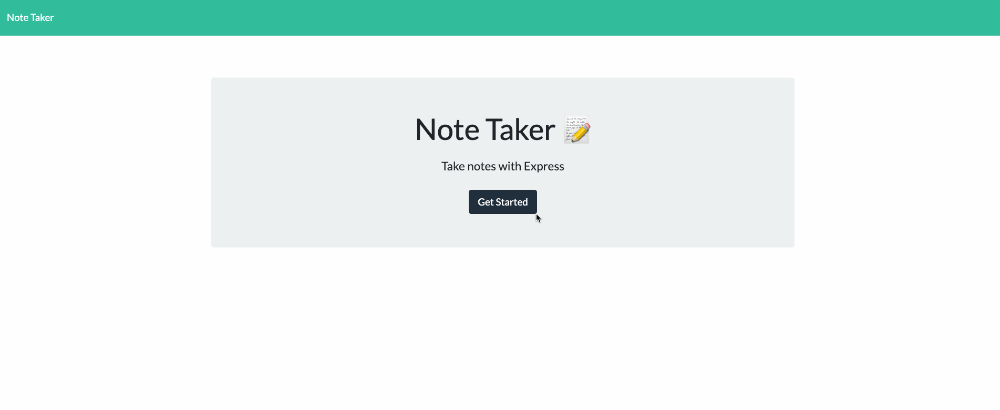

# express-note-taker

##  Heroku URL to the deployed application

[Note-taker](https://lizas-note-taker.herokuapp.com/)

## Description

Note taker application can be used to write, save, and delete notes. This application uses an express backend to save and retrieve note data from a JSON file.

## User Story

AS A user, I want to be able to write and save notes

I WANT to be able to delete notes I've written before

SO THAT I can organize my thoughts and keep track of tasks I need to complete

## Demo

## Technologies Used
- JavaScript - Core logic
- Node and NPM
- Express
- FileSystems
- HTML
- Bootstrap
- Git - version control system to track changes to source code
- GitHub - hosts repository that can be deployed to GitHub Pages